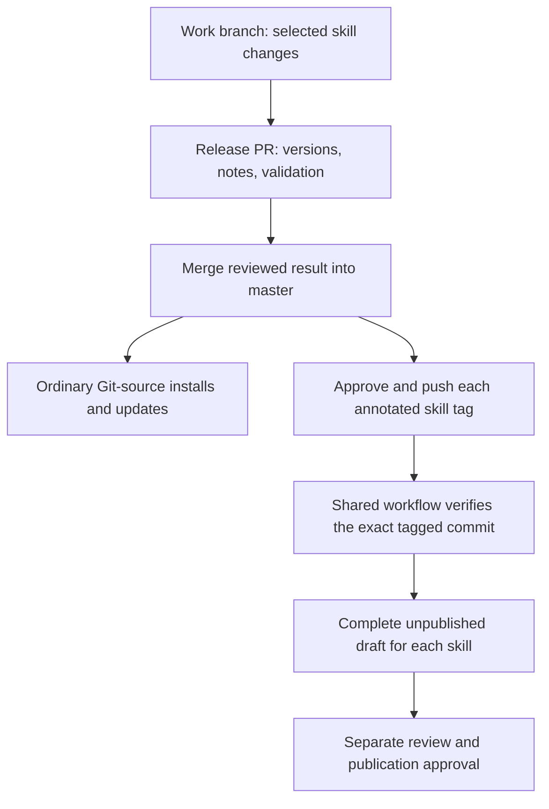

# Releasing skills

Each public skill is versioned independently. A shared release process prepares the
selected skills, while `master` remains the stable source for ordinary installations.

The release contract covers `agent-centric`, `skill-composer`, `guardrails`, and
`mcp-skill-generator`. Their independent tags route through one
[draft workflow](../.github/workflows/draft-release.yml).
Register other skills individually after confirming their owners and validation.
The contract configures draft preparation; each release still requires the review,
push, and publication steps below.

## Release units and ownership

The release unit is a complete `skills/<skill-name>/` directory, including its runtime
instructions, references, scripts, templates, applicable notices, and changelog.
Release only the skills selected for a batch; other skills keep their versions.

Each skill adopting versioned releases has this layout:

```text
skills/<skill-name>/
  SKILL.md
  VERSION
  CHANGELOG.md
  ...package resources...
docs/releases/<skill-name>-v<version>.md
```

`VERSION` contains one SemVer value and is that skill's machine-readable version
owner. Any version exposed elsewhere in the package must agree with it. Keep release
history in `CHANGELOG.md`, outside runtime instructions. Use annotated Git tags named
`<skill-name>-v<version>` and a separate GitHub Release for each tag. Several skill
tags may identify the same reviewed commit.

Fixtures belong to their containing package. Store fixture instructions under names
such as `SKILL.md.fixture` and materialize them in temporary evaluation workspaces;
installed packages must not expose them as additional discoverable skills.

Project copies in `.agents/scripts/` derive from `skills/agent-centric/scripts/` and
have no independent version. Updating an installed skill and synchronizing a project's
managed scripts are separate operations; follow the
[project synchronization instructions](../CLAUDE.md#modifying-agent-centric-scripts).
Commands, agents, and pi extensions are outside this skill release policy.

## Installation and update behavior

The following CLI behavior was checked against the source of
[`skills@1.5.26`](https://registry.npmjs.org/skills/1.5.26), commit
`d667282815248da03a08a18272b5d2eef9caf77c`, on 2026-09-16. These are source findings;
the end-to-end installation checks below remain required when enabling automation or
changing the supported CLI version.

| Installation | Update behavior |
| --- | --- |
| `npx skills add bolasblack/claude-skills --skill <skill-name>` | Follows the repository's default branch, `master`. |
| Git source with `#<skill-name>-v<version>` | Records that ref; `npx skills update` retains it. Select another tag explicitly to upgrade. |
| Direct archive or Release asset URL | Downloads the artifact without the Git-source lock tracking used for updates. |
| Repository installer in copy mode | Reinstall after updating the source checkout. |
| Repository installer in symlink mode | Reads the linked checkout; changes become visible when that checkout changes. |

The CLI's [source parser][cli-parser] and [Git cloning code][cli-git] select the source
ref. Its [update source reconstruction][cli-update-source] preserves a recorded ref;
the [update implementation][cli-update] checks source content, without selecting the
latest GitHub Release or enforcing a compatible SemVer range. The
[installation implementation][cli-add] excludes direct downloads from Git-source lock
tracking. Local copy and symlink behavior is documented in the
[installation guide](../README.md#manual-installation).

Use this command template for a fixed version, replacing both placeholders with a
skill and an existing release version:

```sh
npx skills add 'bolasblack/claude-skills#<skill-name>-v<version>' --skill <skill-name>
```

`#` selects the Git ref; `owner/repo@name` selects a skill. The version after
`npx skills@` selects the installer itself.

**Merging a skill change into `master` makes it available to ordinary Git-source
installs and updates.** Release review and validation must therefore happen before
merge. Publishing a GitHub Release records a prepared version; it does not gate those
installs. Pushing a tag also makes that ref installable while its Release is a draft.
Projects requiring controlled upgrades should install an explicit immutable tag.

## Versions and release history

Choose each skill's bump from changes to its supported invocation, behavior, inputs,
outputs, installation, or configuration contract. At `1.0.0` and above, use patch for
compatible fixes, minor for compatible additions, and major for breaking changes.
During `0.x`, use patch for fixes and normally minor for features or breaking changes.
Explain required downstream action for a breaking change.

Maintain `Unreleased` against the last artifact actually published to that skill's
audience. Preserve authored explanations of what changed and why; commit subjects
alone are not release notes. Follow the
[portable changelog format](../skills/skill-composer/REFERENCE.md#portable-changelog-format).

When adopting this mechanism, establish each skill's existing version and publication
baseline independently. Inspect published artifacts, release records, and any
maintainer-confirmed source distribution history. Existing version headings and an
absence of locally fetched tags do not settle that history. Preserve supported
historical entries; never create an old tag pointing to today's package to fill a gap.
For a true first release, describe the resulting capability rather than changes
between unpublished drafts.

## Release flow



1. Prepare changes on a work branch. A Release PR names the selected skills, each
   previous baseline and next version, user-facing changes, migration needs, and
   validation evidence. It contains the final package changes, `VERSION` updates,
   changelog entries, and `docs/releases/<tag>.md` notes. Shared installation changes
   require checks for every affected package; documentation-only repository changes
   do not require unrelated skill version bumps.
2. Complete the validation below before approving the merge into `master`. Several
   development commits may belong to one release. Record the exact merged commit SHA;
   all tags for that batch point to that reviewed result, even if `master` later moves.
3. Verify the merged result, version owners, note contents, and previous annotated
   tags. Create annotated tags for the selected skills. Show the canonical repository,
   tag names, target SHA, and complete remote payload before requesting push approval.
   A merged Release PR supplies the release commit; preparation must not add a second
   version bump or silently include unrelated commits in a push.
4. For each approved tag, the shared workflow checks out that exact commit, validates
   the selected component, runs its configured tests, and prepares its declared assets.
   Bind the result to one identified successful workflow run. A failed or ambiguous
   run leaves the release unpublished.
5. The workflow creates or updates a draft containing the reviewed note and exact
   asset inventory. A source-only release has zero uploaded assets. If a component
   declares a standalone archive, package its complete skill directory and applicable
   notices, then attach the archive and `SHA256SUMS` before publication. GitHub's
   automatic repository source archives are not standalone skill packages.
6. Review the draft URL, tag SHA, note, and inventory. Publication requires a separate
   decision from push approval. After publication, verify the same identity and
   inventory. A shared workflow may prepare several independent releases; each keeps
   its own version, draft state, and publication decision.

Keep published tags and assets immutable. Repair an incomplete unpublished draft only
through its verified workflow, preserving unrelated remote state. Correct a published
version with a new version. For a bad change already distributed through `master`,
prepare a reviewed fix or revert on `master` and a superseding release; hiding a
GitHub Release does not roll back installed files.

## Validation before distribution

Run the selected packages' complete configured tests and applicable evaluations.
Check frontmatter, links, required resources, version agreement, changelog claims,
and installation discovery. Shared installer changes also run `scripts/install.test.sh`.
Do not mark an unrun host behavior check as passing on the strength of static checks.

Use disposable projects and isolated installation roots to exercise these cases:

- Install from a default-branch source, change its package content, and update; prove
  the expected content arrives and the recorded source stays correct.
- Install from a fixed tag, advance the source branch and create a newer tag, then
  update; prove the original tag and package remain selected. Explicitly selecting
  the new tag must upgrade that skill. Check project and global installation scopes
  separately before claiming both work.
- Check copy and symlink installs, complete package resources, and the absence of
  fixture skills in discovery. Verify managed-script synchronization separately when
  the released package changes those scripts.
- When an archive is declared, verify its exact inventory, checksums, extraction,
  and isolated installation. Record the CLI version and tested host surfaces.

These are acceptance requirements, not completed test results. Exercise source
changes and tags in disposable repositories; real remote writes require their own
authorization. Verify the actual release tag and download after the approved push.

## Automation setup

The executable release contract lives in this document.
The contract must select a component and retain independent version, tag, changelog,
test, and optional asset ownership for every registered skill. Shared workflow code
may be reused; version values remain independent.

Before applying generated files, review a complete `field | value | evidence` table
covering repository identity, release branch, component identities, tag prefixes,
version files, tests, dependency installation, builds, asset directories and patterns,
changelogs, specification paths, setup actions, and action pins. Empty commands and
asset lists are deliberate choices requiring confirmation. Resolve each confirmed
upstream action tag to its full commit SHA and record the provenance.

Automation must support the merged Release PR state and the exact selected tag,
including resuming an existing incomplete draft. Verification and builds run with
read-only repository permissions. Only draft creation and attachment receive write
permissions; checkout disables persisted credentials. Complete assets before the
separate publication approval.

Setup is complete only when the component contract is confirmed, the isolated
candidate diff is reviewed, and required syntax, identity, pin, version, test, and
asset checks pass against both the candidate and the applied files. The workflow
must preserve this policy when regenerating documentation. Each component owns its
version; `version_files` lists only synchronized owners within that component.

[cli-parser]: https://github.com/vercel-labs/skills/blob/d667282815248da03a08a18272b5d2eef9caf77c/src/source-parser.ts
[cli-git]: https://github.com/vercel-labs/skills/blob/d667282815248da03a08a18272b5d2eef9caf77c/src/git.ts
[cli-update-source]: https://github.com/vercel-labs/skills/blob/d667282815248da03a08a18272b5d2eef9caf77c/src/update-source.ts
[cli-update]: https://github.com/vercel-labs/skills/blob/d667282815248da03a08a18272b5d2eef9caf77c/src/update.ts
[cli-add]: https://github.com/vercel-labs/skills/blob/d667282815248da03a08a18272b5d2eef9caf77c/src/add.ts

## Initial registration

The confirmed repository is [`bolasblack/claude-skills`](https://github.com/bolasblack/claude-skills),
with `master` as its default and release branch. Only the following skills are
registered initially; all are source-only releases with no uploaded assets.

| Component | Initial machine version | Existing history |
| --- | --- | --- |
| `agent-centric` | `1.6.1` | [Migrated version history](../skills/agent-centric/CHANGELOG.md) |
| `skill-composer` | `3.2.1` | [Package changelog](../skills/skill-composer/CHANGELOG.md) |
| `guardrails` | `1.1.0` | [Migrated version history](../skills/guardrails/CHANGELOG.md) |
| `mcp-skill-generator` | `0.1.0` | [New version baseline](../skills/mcp-skill-generator/CHANGELOG.md) |

The first three values adopt existing documented versions. `mcp-skill-generator`
had no skill version history; `0.1.0` is its maintainer-confirmed initial machine
baseline. The `0.6.2` in its example `config.toml` belongs to the example MCP server,
not this skill. These values do not assert that matching annotated tags or GitHub
Releases exist, and setup does not create historical tags. Unreleased work still
needs a reviewed next version and note before tagging.

`guardrails` runs its Bun test suite. `mcp-skill-generator` currently has no automated
functional suite: its configured gate checks all four JavaScript files for syntax,
imports the runtime API, and runs the shared installer tests. Those checks do not
prove MCP stdio/HTTP behavior or successful generation against a real server; record
that evidence separately before making those release claims.

Confirmed upstream action tags were fetched with Git and peeled to commit objects
on 2026-09-16. The workflow and contract use only these full commit pins.

| Repository | Confirmed tag | Peeled commit SHA | Source |
| --- | --- | --- | --- |
| `actions/checkout` | `v7.0.1` | `3d3c42e5aac5ba805825da76410c181273ba90b1` | [Upstream tag](https://github.com/actions/checkout/tree/v7.0.1) |
| `actions/setup-python` | `v7.0.0` | `5fda3b95a4ea91299a34e894583c3862153e4b97` | [Upstream tag](https://github.com/actions/setup-python/tree/v7.0.0) |
| `oven-sh/setup-bun` | `v2.2.0` | `0c5077e51419868618aeaa5fe8019c62421857d6` | [Upstream tag](https://github.com/oven-sh/setup-bun/tree/v2.2.0) |
| `actions/setup-node` | `v7.0.0` | `820762786026740c76f36085b0efc47a31fe5020` | [Upstream tag](https://github.com/actions/setup-node/tree/v7.0.0) |

## Release contract

```yaml
branch: "master"
release_mode: "release-pr"
action_pins:
  checkout: "actions/checkout@3d3c42e5aac5ba805825da76410c181273ba90b1"
components:
  agent-centric:
    project: "agent-centric"
    tag_prefix: "agent-centric-v"
    test: |-
      set -eu
      python3 -B skills/agent-centric/scripts/simple_yaml.test.py
      python3 -B skills/agent-centric/scripts/generate-index.test.py
      python3 -B skills/agent-centric/scripts/validate-agds.test.py
      bash scripts/install.test.sh
    build: ""
    install: ""
    version_files:
      - "skills/agent-centric/VERSION"
    asset_dir: null
    assets: []
    changelog: "skills/agent-centric/CHANGELOG.md"
    spec_dirs: []
    setup_actions:
      -
        uses: "actions/setup-python@5fda3b95a4ea91299a34e894583c3862153e4b97"
        with:
          "python-version": "3.13"
    paths:
      - "skills/agent-centric"
      - "scripts"
  skill-composer:
    project: "skill-composer"
    tag_prefix: "skill-composer-v"
    test: |-
      set -eu
      python3 -B skills/skill-composer/package_test.py
      python3 -B skills/skill-composer/scripts/fetch-harness-docs_test.py
      python3 -B skills/skill-composer/scripts/eval-skill_test.py
      python3 -B skills/skill-composer/scripts/eval-skill.py check skills/skill-composer
      bash scripts/install.test.sh
    build: ""
    install: ""
    version_files:
      - "skills/skill-composer/VERSION"
    asset_dir: null
    assets: []
    changelog: "skills/skill-composer/CHANGELOG.md"
    spec_dirs:
      - "skills/skill-composer"
    setup_actions:
      -
        uses: "actions/setup-python@5fda3b95a4ea91299a34e894583c3862153e4b97"
        with:
          "python-version": "3.13"
    paths:
      - "skills/skill-composer"
      - "scripts"
  guardrails:
    project: "guardrails"
    tag_prefix: "guardrails-v"
    test: |-
      set -eu
      bun test skills/guardrails/scripts/guardrails.test.ts
      bash scripts/install.test.sh
    build: ""
    install: ""
    version_files:
      - "skills/guardrails/VERSION"
    asset_dir: null
    assets: []
    changelog: "skills/guardrails/CHANGELOG.md"
    spec_dirs:
      - "skills/guardrails/references"
    setup_actions:
      -
        uses: "actions/setup-python@5fda3b95a4ea91299a34e894583c3862153e4b97"
        with:
          "python-version": "3.13"
      -
        uses: "oven-sh/setup-bun@0c5077e51419868618aeaa5fe8019c62421857d6"
        with:
          "bun-version": "1.3.14"
    paths:
      - "skills/guardrails"
      - "scripts"
  mcp-skill-generator:
    project: "mcp-skill-generator"
    tag_prefix: "mcp-skill-generator-v"
    test: |-
      set -eu
      for script in skills/mcp-skill-generator/scripts/*.mjs; do
        node --check "$script"
      done
      node --input-type=module -e "await import('./skills/mcp-skill-generator/scripts/api.mjs')"
      bash scripts/install.test.sh
    build: ""
    install: ""
    version_files:
      - "skills/mcp-skill-generator/VERSION"
    asset_dir: null
    assets: []
    changelog: "skills/mcp-skill-generator/CHANGELOG.md"
    spec_dirs:
      - "skills/mcp-skill-generator/docs"
    setup_actions:
      -
        uses: "actions/setup-python@5fda3b95a4ea91299a34e894583c3862153e4b97"
        with:
          "python-version": "3.13"
      -
        uses: "actions/setup-node@820762786026740c76f36085b0efc47a31fe5020"
        with:
          "node-version": "24.20.0"
          "package-manager-cache": "false"
    paths:
      - "skills/mcp-skill-generator"
      - "scripts"
```
